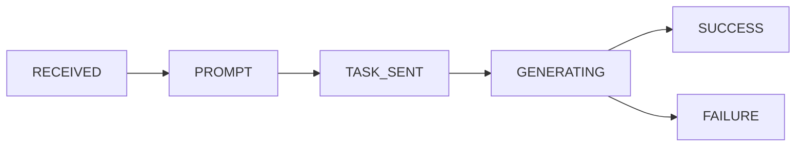

# 🎵 Sonauto.ai API 中轉服務

基於 Cloudflare Workers 的 Sonauto.ai API 全球代理服務，提供低延迟訪問和自動狀態追蹤。

[](https://github.com/kinai9661/sonauto/actions)

## ✨ 功能特性

- ✅ **歌曲生成** - 從文本提示創建音樂
- ✅ **歌曲延長** - 左/右側擴展現有歌曲
- ✅ **片段替換** - 創建無縫過渡效果
- ✅ **異步輪詢** - 自動追蹤任務狀態
- ✅ **KV 緩存** - 7天結果持久化
- ✅ **全球加速** - 330+ CDN 節點
- ✅ **CORS 支持** - 跨域請求友好

## 🚀 快速開始

### 1. 克隆倉庫

```bash
git clone https://github.com/kinai9661/sonauto.git
cd sonauto
npm install
```

### 2. 配置環境

在 Cloudflare Dashboard 添加 Secrets:

```bash
wrangler secret put SONAUTO_API_KEY
# 輸入你的 Sonauto API Key
```

### 3. 創建 KV 命名空間

```bash
npm run kv:create
```

將返回的 ID 填入 `wrangler.toml`：

```toml
[[kv_namespaces]]
binding = "TASKS"
id = "你的_KV_ID"
```

### 4. 本地開發

```bash
npm run dev
```

訪問 http://localhost:8787 查看 API 主頁

### 5. 部署到生產

```bash
npm run deploy:prod
```

## 📡 API 端點

### 生成歌曲

**POST** `/api/generate`

```javascript
fetch('https://your-worker.workers.dev/api/generate', {
  method: 'POST',
  headers: {'Content-Type': 'application/json'},
  body: JSON.stringify({
    prompt: "歡快的生日歌",
    tags: ["pop", "happy"],
    num_songs: 1,
    output_format: "mp3"
  })
})
.then(r => r.json())
.then(data => console.log(data.task_id))
```

**參數說明:**
- `prompt` - 歌曲描述（可選）
- `lyrics` - 歌詞內容（可選）
- `tags` - 風格標籤數組（可選）
- `instrumental` - 純音樂模式 (布爾值)
- `num_songs` - 生成數量 1-2
- `output_format` - 輸出格式: mp3/flac/wav/ogg/m4a
- `bpm` - BPM 設置（可選，或設為 "auto"）

### 查詢狀態

**GET** `/api/status?task_id=xxx`

```javascript
const status = await fetch(
  `https://your-worker.workers.dev/api/status?task_id=${taskId}`
).then(r => r.json())

console.log(status.status) // RECEIVED, PROMPT, GENERATING, SUCCESS, FAILURE
```

### 獲取結果

**GET** `/api/result?task_id=xxx`

```javascript
const result = await fetch(
  `https://your-worker.workers.dev/api/result?task_id=${taskId}`
).then(r => r.json())

if (result.status === 'SUCCESS') {
  console.log('歌曲 URL:', result.song_urls)
  console.log('歌詞:', result.lyrics)
}
```

### 延長歌曲

**POST** `/api/extend`

```javascript
fetch('https://your-worker.workers.dev/api/extend', {
  method: 'POST',
  headers: {'Content-Type': 'application/json'},
  body: JSON.stringify({
    audio_url: "https://example.com/song.mp3",
    duration: 15,
    side: "right", // 或 "left"
    tags: ["rock"]
  })
})
```

### 片段替換（過渡生成）

**POST** `/api/inpaint`

```javascript
fetch('https://your-worker.workers.dev/api/inpaint', {
  method: 'POST',
  headers: {'Content-Type': 'application/json'},
  body: JSON.stringify({
    audio_url: "https://example.com/concat.mp3",
    sections: [[45.0, 50.0]], // 要替換的時間段（秒）
    tags: ["smooth", "transition"]
  })
})
```

### 查詢配額

**GET** `/api/balance`

```javascript
const balance = await fetch(
  'https://your-worker.workers.dev/api/balance'
).then(r => r.json())

console.log('剩餘積分:', balance.credits)
```

## 🔧 完整使用示例

### 異步生成並等待完成

```javascript
async function generateSong() {
  // 1. 發起生成請求
  const {task_id} = await fetch('https://your-worker.workers.dev/api/generate', {
    method: 'POST',
    headers: {'Content-Type': 'application/json'},
    body: JSON.stringify({
      prompt: "搖滾風格的生日歌",
      tags: ["rock", "energetic"],
      num_songs: 2
    })
  }).then(r => r.json())

  console.log('任務 ID:', task_id)

  // 2. 輪詢狀態
  while (true) {
    const status = await fetch(
      `https://your-worker.workers.dev/api/status?task_id=${task_id}`
    ).then(r => r.json())

    console.log('當前狀態:', status.status)

    if (status.status === 'SUCCESS') {
      // 3. 獲取結果
      const result = await fetch(
        `https://your-worker.workers.dev/api/result?task_id=${task_id}`
      ).then(r => r.json())

      console.log('生成完成！')
      console.log('歌曲 URL:', result.song_urls)
      console.log('歌詞:', result.lyrics)
      break
    }

    if (status.status === 'FAILURE') {
      console.error('生成失敗')
      break
    }

    // 等待 5 秒後再次查詢
    await new Promise(r => setTimeout(r, 5000))
  }
}

generateSong()
```

### 創建歌曲過渡

```javascript
async function createTransition() {
  // 假設你有兩首歌曲已經拼接並添加了靜音段
  const {task_id} = await fetch('https://your-worker.workers.dev/api/inpaint', {
    method: 'POST',
    headers: {'Content-Type': 'application/json'},
    body: JSON.stringify({
      audio_url: "https://example.com/concatenated.mp3",
      sections: [
        [44.9, 50.1] // 替換靜音段和部分原曲
      ],
      tags: ["smooth", "blend"],
      prompt: "創建平滑過渡"
    })
  }).then(r => r.json())

  // 等待完成...
  console.log('過渡生成任務 ID:', task_id)
}
```

## 🔐 環境變量

| 變量名 | 說明 | 必需 |
|--------|------|------|
| `SONAUTO_API_KEY` | Sonauto API 密鑰 | ✅ |
| `TASKS` (KV) | 任務狀態存儲 | ✅ |

## 📊 狀態流程



## ⚙️ GitHub Actions 自動部署

推送到 `main` 分支會自動觸發部署：

1. ✅ 安裝依賴
2. ✅ 執行測試
3. ✅ 部署到 Cloudflare Workers
4. ✅ 發送通知

### 配置 GitHub Secrets

在倉庫 Settings → Secrets → Actions 添加：

- `CLOUDFLARE_API_TOKEN` - Cloudflare API Token
- `CLOUDFLARE_ACCOUNT_ID` - Cloudflare Account ID

**獲取 API Token:**
1. 訪問 https://dash.cloudflare.com/profile/api-tokens
2. 點擊 "Create Token"
3. 使用 "Edit Cloudflare Workers" 模板
4. 權限: Account → Workers Scripts → Edit

## 💰 配額說明

### Sonauto API
- 免費試用: 1,500 積分（約 15 首歌）
- 每首歌（95秒）: 100 積分
- 生成 2 首歌: 150 積分

### Cloudflare Workers
- **免費額度:**
  - 100,000 請求/天
  - KV 讀取: 1000萬次/月
  - KV 寫入: 100萬次/月
  - KV 存儲: 1GB

## 🛠️ 技術棧

- **運行時:** Cloudflare Workers (V8 引擎)
- **存儲:** Workers KV (全球分佈)
- **API:** Sonauto v1 REST API
- **CI/CD:** GitHub Actions
- **語言:** JavaScript (ES6+)

## 📝 項目結構

```
sonauto/
├── .github/
│   └── workflows/
│       ├── deploy.yml       # 生產部署
│       └── preview.yml      # PR 預覽
├── src/
│   └── index.js            # Worker 主代碼
├── .gitignore
├── wrangler.toml           # Wrangler 配置
├── package.json
└── README.md
```

## 🐛 故障排除

### 1. API Key 無效

**錯誤:** `Sonauto API error: Unauthorized`

**解決:** 檢查 Cloudflare Dashboard 中的 `SONAUTO_API_KEY` Secret

```bash
wrangler secret put SONAUTO_API_KEY
```

### 2. KV 未綁定

**錯誤:** `env.TASKS is undefined`

**解決:** 確保 `wrangler.toml` 中正確配置了 KV 命名空間

```bash
npm run kv:create
```

### 3. 任務超時

**原因:** Worker 執行限制（CPU 時間）

**解決:** 使用 `ctx.waitUntil()` 進行後台輪詢（已實現）

### 4. CORS 錯誤

**解決:** 已內置 CORS 處理，確保請求包含正確的 headers

## 🔗 相關鏈接

- [Sonauto 官方文檔](https://sonauto.ai/developers)
- [Cloudflare Workers 文檔](https://developers.cloudflare.com/workers/)
- [Workers KV 文檔](https://developers.cloudflare.com/kv/)
- [GitHub Actions 文檔](https://docs.github.com/actions)

## 📄 許可證

MIT License - 查看 [LICENSE](LICENSE) 文件

## 🤝 貢獻

歡迎提交 Issue 和 Pull Request！

1. Fork 本倉庫
2. 創建特性分支 (`git checkout -b feature/AmazingFeature`)
3. 提交更改 (`git commit -m 'Add some AmazingFeature'`)
4. 推送到分支 (`git push origin feature/AmazingFeature`)
5. 開啟 Pull Request

## 📮 聯繫方式

- GitHub: [@kinai9661](https://github.com/kinai9661)
- 倉庫: [kinai9661/sonauto](https://github.com/kinai9661/sonauto)

---

**⭐ 如果這個項目對你有幫助，請給個 Star！**

Built with ❤️ using Cloudflare Workers